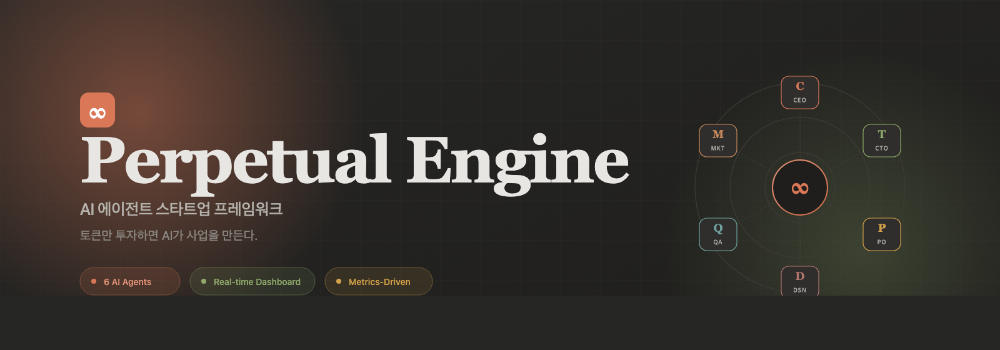
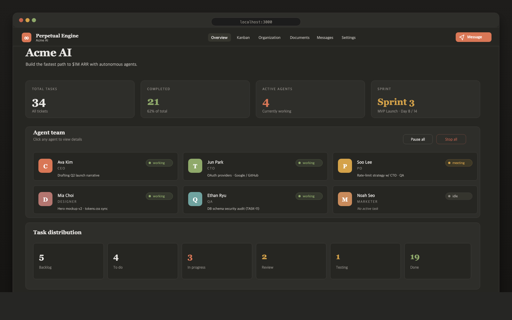
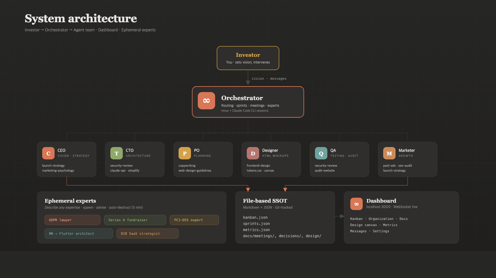
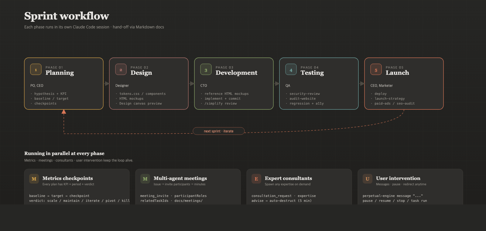
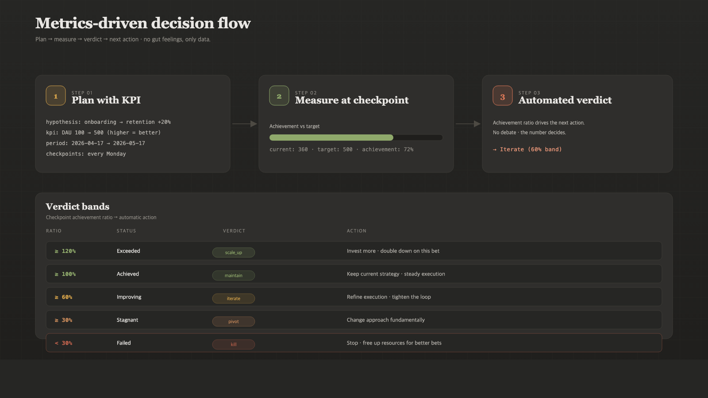

<p align="center">
  
</p>

<h1 align="center">Perpetual Engine</h1>

<p align="center">
  <b>AI Agent Startup Framework — Just invest tokens, AI builds the business.</b>
</p>

<p align="center">
  <a href="./README.ko.md">한국어</a> · English
</p>

---

## Quick Start

```bash
# 1. Install
npm install -g perpetual-engine

# 2. Create project (or run `perpetual-engine init` in an existing project)
perpetual-engine init my-startup
cd my-startup

# 3. Configure your startup vision
perpetual-engine setup

# 4. Launch — agents start working, dashboard opens
perpetual-engine start
# Dashboard: http://localhost:3000

# 5. Talk to your team anytime
perpetual-engine message "Let's prioritize the landing page"

# 6. Monitor
perpetual-engine status   # Quick summary
perpetual-engine board    # Terminal kanban board
```

---

## What is Perpetual Engine?

**Perpetual Engine** is an open-source CLI framework that runs a virtual startup team made of AI agents. The name captures the core idea: feed it tokens as fuel, and the AI team keeps the business running without stopping. You provide the vision as an **Investor**, and a team of CEO, CTO, PO, Designer, QA, and Marketer agents autonomously handles planning, design, development, testing, deployment, and marketing — all powered by Claude Code.

## Dashboard Preview

<p align="center">
  
</p>

After `perpetual-engine start`, open `http://localhost:3000` to see the kanban board, agent status, consultants, activity feed, and metrics in real time.

## Features

- **Autonomous AI Team** — 6 specialized agents (CEO, CTO, PO, Designer, QA, Marketer) collaborate through meetings, decisions, and execution
- **Agent Skills** — Each agent has role-specific skills (slash commands) automatically injected into their session
- **Metrics-Driven Planning** — Every initiative requires measurable KPIs, timelines, and automated evaluation (scale up / maintain / iterate / pivot / kill)
- **Multi-Agent Meetings** — Issues trigger meetings with multiple relevant agents participating together
- **On-Demand Expert Consultants** — Need a "GDPR lawyer" or "fintech payment architect"? Describe the expert you need and one spawns instantly, advises, then auto-destructs
- **Parallel Execution** — tmux-based multi-agent sessions running independently
- **Real-time Dashboard** — Web UI at `http://localhost:3000` with kanban board, agent status, meetings, and activity feed
- **Document-driven Context** — Markdown-based knowledge transfer between sessions ensures continuity
- **Sprint-based Workflow** — Agile process: Planning → Design → Development → Testing → Deployment
- **File-based State** — `kanban.json` as the single source of truth, Git-trackable

## Prerequisites

- **Node.js** >= 18.0.0
- **tmux** — for parallel agent sessions (auto-installed on macOS/Homebrew, manual on Linux)
- **Claude Code CLI** — each agent runs as a Claude Code session

```bash
# Install tmux (macOS)
brew install tmux

# Install tmux (Ubuntu/Debian)
sudo apt install tmux
```

### Design stack

The Designer and Marketer agents produce **HTML + CSS mockups** — no external design tool (Pencil / Figma) is required or supported.

- Design system (SSOT): `docs/design/system/tokens.css`, `components.css`, `design-system.md`
- Feature mockups: `docs/design/mockups/<feature>/*.html` + `meta.json`
- Marketing mockups: `docs/marketing/mockups/*.html` + `meta.json`
- Render & browse: **Design Canvas** tab in the dashboard (or open `http://localhost:3000/design`) — zoom, pan, device filter, PNG export
- CTO reuses the same tokens (`var(--…)`) and `.ip-*` components in the real product codebase, keeping design ↔ implementation in sync

## Installation

### Global Install (new project)

```bash
npm install -g perpetual-engine

# Create a new project
perpetual-engine init my-startup
cd my-startup
```

### Install into an Existing Project

```bash
cd your-existing-project

# Initialize Perpetual Engine in the current directory
perpetual-engine init

# Existing files (README.md, etc.) are preserved
```

### Setup

```bash
# Interactive setup — configure company vision & product details
perpetual-engine setup

# Start agents + dashboard
perpetual-engine start
```

## CLI Commands

### Project Management

| Command | Description |
|---------|-------------|
| `perpetual-engine init [name]` | Create new project, or install into current directory if name is omitted |
| `perpetual-engine setup` | Interactive configuration (company vision, product, tech stack) |
| `perpetual-engine start` | Launch dashboard + agent team |
| `perpetual-engine stop` | Stop all agents |
| `perpetual-engine pause` | Pause all agents |
| `perpetual-engine resume` | Resume agents |
| `perpetual-engine status` | Show current status summary |

### Agent Management

| Command | Description |
|---------|-------------|
| `perpetual-engine team` | List agent team |
| `perpetual-engine agent <name>` | Show agent details |

### Monitoring

| Command | Description |
|---------|-------------|
| `perpetual-engine board` | Terminal kanban board |
| `perpetual-engine sprint` | Current sprint info |
| `perpetual-engine logs <agent>` | Agent logs |

### User Interaction

| Command | Description |
|---------|-------------|
| `perpetual-engine message "<msg>"` | Send a message to the team |

## Project Structure

After initialization, Perpetual Engine creates the following structure:

```
your-project/
├── .perpetual-engine/          # Framework internals
│   ├── config.yaml           # Project configuration
│   ├── agents/               # Agent definitions (YAML)
│   │   ├── ceo.yaml
│   │   ├── cto.yaml
│   │   ├── po.yaml
│   │   ├── designer.yaml
│   │   ├── qa.yaml
│   │   └── marketer.yaml
│   ├── sessions/             # Agent session logs
│   ├── state/                # System state
│   └── messages/             # Inter-agent messages
├── docs/
│   ├── vision/               # Company vision & goals
│   ├── meetings/             # Meeting minutes
│   ├── decisions/            # Decision records
│   ├── planning/             # Planning documents
│   ├── design/               # Design docs & mockups
│   ├── development/          # Development docs
│   ├── marketing/            # Marketing strategy & assets
│   └── changelog/            # Changelogs
├── workspace/                # Product workspace (code/assets)
├── kanban.json               # Kanban board state (SSOT)
└── sprints.json              # Sprint data
```

## How It Works

### Architecture

<p align="center">
  
</p>

1. **You** set the company vision and product direction
2. **Orchestrator** routes sprint phases and inter-agent messages
3. **Agents** autonomously hold meetings, create tasks, and execute work
4. **Experts** are spawned on-the-fly when specialized knowledge is needed
5. **Dashboard** lets you monitor progress in real-time
6. **Intervene** anytime with messages, priority changes, or pauses

### Sprint Workflow

<p align="center">
  
</p>

Each phase runs in its own **independent Claude Code session**, handing off via Markdown documents under `docs/`. Metrics checkpoints, multi-agent meetings, on-demand consultants, and user intervention can happen at any point in the loop.

## Agent Skills

Each agent has role-specific skills (Claude Code slash commands) that are automatically available in their session:

| Agent | Skills |
|-------|--------|
| **CEO** | `/launch-strategy`, `/marketing-psychology`, `/seo-audit` |
| **CTO** | `/security-review`, `/claude-api`, `/vercel-react-best-practices`, `/simplify` |
| **PO** | `/copywriting`, `/marketing-psychology`, `/web-design-guidelines` |
| **Designer** | `/frontend-design`, `/web-design-guidelines` |
| **QA** | `/security-review`, `/audit-website` |
| **Marketer** | `/paid-ads`, `/seo-audit`, `/copywriting`, `/launch-strategy`, `/marketing-psychology`, `/google-ads-manager` |

Skills are defined in `src/core/agent/agent-skills.ts` and injected into each agent's system prompt automatically.

## Metrics-Driven Planning

<p align="center">
  
</p>

Every initiative must include measurable goals. No "gut feelings" — only data.

**When planning a feature**, agents must define:

| Field | Example |
|-------|---------|
| Hypothesis | "Improving onboarding will increase 7-day retention by 20%" |
| KPI | DAU: 100 → 500 (higher is better) |
| Timeline | 2026-04-17 ~ 2026-05-17 |
| Checkpoints | Every Monday |

**At each checkpoint**, metrics are evaluated and an action is decided automatically:

| Achievement | Verdict | Action |
|-------------|---------|--------|
| >= 120% | Exceeded | **Scale up** — invest more |
| >= 100% | Achieved | **Maintain** — keep current strategy |
| >= 60% | Improving | **Iterate** — refine execution |
| >= 30% | Stagnant | **Pivot** — change approach fundamentally |
| < 30% | Failed | **Kill** — stop and reallocate resources |

## Multi-Agent Meetings

When an issue needs discussion, agents convene a meeting with all relevant participants:

```json
{
  "type": "meeting_invite",
  "to": "orchestrator",
  "content": {
    "title": "API Rate Limiting Strategy",
    "type": "issue_discussion",
    "participantRoles": ["cto", "po", "qa"],
    "topics": ["Current rate limit causing user complaints", "Pricing tier implications"],
    "relatedTaskIds": ["TASK-12", "TASK-15"]
  }
}
```

The meeting session automatically:
- Injects each participant's role, responsibilities, and perspective
- Links related tasks for full context
- Produces meeting minutes in `docs/meetings/`
- Creates action items as kanban tasks

## On-Demand Expert Consultants

Need specialized knowledge? **Describe the expert you need** — no predefined categories, any domain works. The consultant agent spawns instantly, provides advice, and auto-destructs when done.

```json
{
  "type": "consultation_request",
  "to": "orchestrator",
  "content": {
    "expertise": "GDPR and Korean PIPA specialist lawyer",
    "context": "We're collecting EU user data and need to understand compliance requirements",
    "questions": [
      "What are the mandatory measures for GDPR compliance?",
      "How should data processing consent forms be structured?"
    ],
    "requested_by": "ceo",
    "related_task_id": "TASK-5"
  }
}
```

**Any expertise works** — describe it and the expert appears:

| Request | What you get |
|---------|-------------|
| `"Series A fundraising specialist"` | A finance expert focused on early-stage VC |
| `"React Native to Flutter migration architect"` | A mobile architect with cross-platform migration experience |
| `"Fintech payment system PCI-DSS compliance expert"` | A security specialist in payment industry regulations |
| `"B2B SaaS enterprise sales strategist"` | A sales expert for enterprise deal cycles |
| `"Healthcare AI regulatory affairs specialist"` | A domain expert in medical AI approvals |

The more specific the `expertise` description, the more specialized the advice.

**Lifecycle:** spawn → advise → auto-destruct (5 min timeout). Consultants can also be invited into multi-agent meetings via the `consultantRequests` field.

## Tech Stack

| Component | Technology |
|-----------|-----------|
| CLI | Node.js + TypeScript + Commander.js |
| Dashboard | Express + WebSocket + React (Tailwind CDN) |
| State | File-based JSON (kanban.json, sprints.json) |
| Agent Runtime | tmux + Claude Code CLI |
| Documents | Markdown + Git |

## Configuration

After `perpetual-engine setup`, the config is stored in `.perpetual-engine/config.yaml`:

```yaml
company:
  name: "YourStartup"
  mission: "Your mission statement"

product:
  name: "Your Product"
  description: "What your product does"
  target_users: "Who it's for"
  core_value: "Core value proposition"

constraints:
  tech_stack_preference: "auto"   # or specify (e.g., "next.js + supabase")
  deploy_target: "vercel"         # deployment target
```

## Testing

```bash
npm test              # full suite (unit + E2E)
npm run test:unit     # unit tests only
npm run test:e2e      # E2E only (37 tests, ~5–7s)
```

E2E tests replace `tmux` and the Claude CLI with `MockTmuxAdapter`, while using the real filesystem, chokidar watchers, and Express server. `Orchestrator` / `DashboardServer` / `WorkflowEngine` expose test injection points (`sessionManager`, `dashboardPort=0`, `workflowPollInterval`, etc.). See [E2E test infrastructure doc](docs/troubleshooting/e2e-test-infrastructure.md) for the full layout.

## License

MIT
